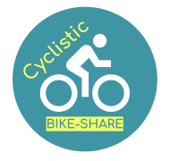
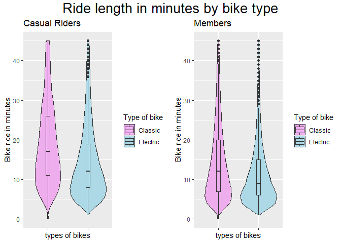
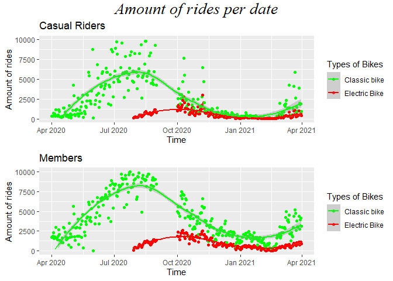

Case Study: Cyclistic a bike share company. Using R
================
Douwe John Horsthuis
6/5/2022

# Cyclistic bike-share



## Case study by [Douwe Horsthuis](https://github.com/DouweHorsthuis) for the Google Data Analytics Capstone

For this case study I am looking at data from a fictional company,
Cyclistic, and I will try to answer questions based on their openly
available data that can be found
[here](https://divvy-tripdata.s3.amazonaws.com/index.html)

## steps taken before this using R

1 - download the last 12 months worth of data 2 - unzip all the excel
files so they can be uploaded into an sql database (bigquery) 3 -
202009-divvy-tripdata does not work 4- realized it doesn’t work quickly
so instead use google drive to upload it both for space purposes and
speed 5- create a sql statement to get the data 6- made sure that old
and new data have the same data types by updating the old datatypes so
that new datasets can be added easily.

[**The R code can be found
here**](https://github.com/DouweHorsthuis/Case-study-Cyclistic-a-bike-share-company/blob/main/code.R)

It’s possible to get the dataset directly from google’s bigquery. Using
the code below. However I personally prefer using the csv file. So

| ride_id          | rideable_type | started_at              | ended_at                | start_station_name             | f0\_ | end_station_name             | f1\_ | start_lat | start_lng |  end_lat |   end_lng | member_casual |
|:-----------------|:--------------|:------------------------|:------------------------|:-------------------------------|:-----|:-----------------------------|:-----|----------:|----------:|---------:|----------:|:--------------|
| 61544BB47B9A7813 | docked_bike   | 2020-08-08 10:07:41 UTC | 2020-08-08 10:18:05 UTC | Pine Grove Ave & Waveland Ave  | 232  | Broadway & Belmont Ave       | 296  |  41.94947 | -87.64645 | 41.94011 | -87.64545 | casual        |
| F3B969AB01DCBDA3 | docked_bike   | 2020-08-08 10:07:41 UTC | 2020-08-08 10:32:43 UTC | Lake Shore Dr & Wellington Ave | 157  | McClurg Ct & Erie St         | 142  |  41.93669 | -87.63683 | 41.89450 | -87.61785 | member        |
| E54EB988E676193B | docked_bike   | 2020-08-08 10:07:40 UTC | 2020-08-08 10:35:02 UTC | Franklin St & Illinois St      | 672  | Southport Ave & Clybourn Ave | 307  |  41.89102 | -87.63548 | 41.92077 | -87.66371 | member        |
| 9CECBFAE7A62C47E | docked_bike   | 2020-08-08 10:07:38 UTC | 2020-08-08 18:22:49 UTC | Clark St & Lincoln Ave         | 141  | Seeley Ave & Roscoe St       | 308  |  41.91569 | -87.63460 | 41.94340 | -87.67962 | casual        |
| 197B08AFFA83A458 | docked_bike   | 2020-08-08 10:07:38 UTC | 2020-08-08 10:26:48 UTC | Drake Ave & Fullerton Ave      | 503  | Marshfield Ave & Cortland St | 58   |  41.92440 | -87.71544 | 41.91602 | -87.66888 | member        |
| A3489E65403474A6 | docked_bike   | 2020-08-08 10:07:31 UTC | 2020-08-08 10:23:11 UTC | Chicago Ave & Washington St    | 597  | Evanston Civic Center        | 661  |  42.03256 | -87.67910 | 42.05704 | -87.68655 | casual        |

    ## [1] 2933776

    ## [1] "docked_bike"   "electric_bike" "classic_bike"

    ## [1] 705

    ## [1] 1258

    ## [1] 705

    ## [1] 1259

    ## [1] "casual" "member"

Because `length(unique(data$ride_id))` == the full length of the data,
we now know that every ride is unique and that there is no ID number for
individual members in this data. We now know that there are 3 types of
transportation “docked_bike” “electric_bike” “classic_bike”. We know
that
`length(unique(data$start_station_name))==length(unique(data$end_station_name))`==705
, but that both f0 and f1 are not the same length and not the same as
eachother. Because of the we leave the ID alone

# questions about the data

1.  How do annual members and casual riders use Cyclistic bikes
    differently?
2.  Why would casual riders buy Cyclistic annual memberships?
3.  How can Cyclistic use digital media to influence casual riders to
    become members?

## How to answer the questions / can we answers the questiosn with the current data

1.  split the data in 2 groups see if there are different trends
2.  see if there is something that is the difference that causes people
    to be in one group or another
3.  not sure if answerable with the current data.

# Preparing the data

To prepare the data there are some things we need to do before we can
create 2 subgroups.

1.  the dates are in the wrong class.
2.  there is no ride length
3.  TBD

## describing the data after creating the 2 groups

``` r
cat("These are the casual riders\n\n\n\n")
```

    ## These are the casual riders

``` r
describe(data_casual$rideable_type)
```

    ## data_casual$rideable_type 
    ##        n  missing distinct 
    ##  1191293        0        3 
    ##                                                     
    ## Value       classic_bike   docked_bike electric_bike
    ## Frequency          70630        944809        175854
    ## Proportion         0.059         0.793         0.148

``` r
describe(data_casual$start_station_name)
```

    ## data_casual$start_station_name 
    ##        n  missing distinct 
    ##  1158647    32646      693 
    ## 
    ## lowest : 2112 W Peterson Ave          63rd St Beach                900 W Harrison St            Aberdeen St & Jackson Blvd   Aberdeen St & Monroe St     
    ## highest: Wood St & Taylor St (Temp)   Woodlawn Ave & 55th St       Woodlawn Ave & 75th St       Woodlawn Ave & Lake Park Ave Yates Blvd & 75th St

``` r
describe(data_casual$end_station_name)
```

    ## data_casual$end_station_name 
    ##        n  missing distinct 
    ##  1149432    41861      703 
    ## 
    ## lowest : 2112 W Peterson Ave          63rd St Beach                900 W Harrison St            Aberdeen St & Jackson Blvd   Aberdeen St & Monroe St     
    ## highest: Wood St & Taylor St (Temp)   Woodlawn Ave & 55th St       Woodlawn Ave & 75th St       Woodlawn Ave & Lake Park Ave Yates Blvd & 75th St

``` r
summary(data_casual$ride_length)
```

    ##   Length    Class     Mode 
    ##  1191293 difftime  numeric

``` r
stat.desc(data_casual$ride_length)
```

    ##                             x
    ## nbr.val       1191293.0000000
    ## nbr.null        11340.0000000
    ## nbr.na              0.0000000
    ## min            -28996.0000000
    ## max             55684.0000000
    ## range           84680.0000000
    ## sum          52828212.0000000
    ## median             22.0000000
    ## mean               44.3452719
    ## SE.mean             0.4104103
    ## CI.mean.0.95        0.8043901
    ## var            200657.3127401
    ## std.dev           447.9478907
    ## coef.var           10.1013676

``` r
cat("\n\nThese are the members\n\n\n\n")
```

    ## 
    ## 
    ## These are the members

``` r
describe(data_member$rideable_type)
```

    ## data_member$rideable_type 
    ##        n  missing distinct 
    ##  1742692        0        3 
    ##                                                     
    ## Value       classic_bike   docked_bike electric_bike
    ## Frequency         248861       1209054        284777
    ## Proportion         0.143         0.694         0.163

``` r
describe(data_member$start_station_name)
```

    ## data_member$start_station_name 
    ##        n  missing distinct 
    ##  1687702    54990      695 
    ## 
    ## lowest : 2112 W Peterson Ave          63rd St Beach                900 W Harrison St            Aberdeen St & Jackson Blvd   Aberdeen St & Monroe St     
    ## highest: Wood St & Taylor St (Temp)   Woodlawn Ave & 55th St       Woodlawn Ave & 75th St       Woodlawn Ave & Lake Park Ave Yates Blvd & 75th St

``` r
describe(data_member$end_station_name)
```

    ## data_member$end_station_name 
    ##        n  missing distinct 
    ##  1681411    61281      691 
    ## 
    ## lowest : 2112 W Peterson Ave          63rd St Beach                900 W Harrison St            Aberdeen St & Jackson Blvd   Aberdeen St & Monroe St     
    ## highest: Wood St & Taylor St (Temp)   Woodlawn Ave & 55th St       Woodlawn Ave & 75th St       Woodlawn Ave & Lake Park Ave Yates Blvd & 75th St

``` r
summary(data_member$ride_length)
```

    ##   Length    Class     Mode 
    ##  1742692 difftime  numeric

``` r
stat.desc(data_member$ride_length)
```

    ##                             x
    ## nbr.val       1742692.0000000
    ## nbr.null        23749.0000000
    ## nbr.na              0.0000000
    ## min            -29050.0000000
    ## max             58720.0000000
    ## range           87770.0000000
    ## sum          19594492.0000000
    ## median             12.0000000
    ## mean               11.2438067
    ## SE.mean             0.2926040
    ## CI.mean.0.95        0.5734937
    ## var            149204.2323449
    ## std.dev           386.2696368
    ## coef.var           34.3539912

of interest:

1.  for both groups the dock_bike is the most used by far (69% & 79%)  
2.  Both group have the same most used starts/stops and least used
    starts/stops  
3.  There are minus times (in minutes) and the max time is 58720 minutes
    == 978 hours == 40 days
    -   option 1 - get rid of all minus rides and outliers

    -   option 2 - get rid of all minus riders but leave positive

    -   option 3 - leave all but see how many of these exist
4.  the mean (11.2/44.34) and median (12/22) are very different for
    (members/casual)

**Next we are looking how much each group rode**

``` r
#first organize date by month 
data_casual$start_date<-as.Date(data_casual$start_date,format="%Y-%m-%d")
data_casual$ones<-1
data_casual_grouped <- data_casual %>%
  group_by(start_date, rideable_type) %>%
  summarise(ones=sum(ones))

data_member$start_date<-as.Date(data_member$start_date,format="%Y-%m-%d")
data_member$ones<-1
data_member_grouped <- data_member %>%
  group_by(start_date, rideable_type) %>%
  summarise(ones=sum(ones))


fig1<- ggplot(data=data_casual_grouped, aes(x=start_date, y=ones, color=rideable_type))+
  labs(x = "Time", y = "Amount of rides", title = "Casual Riders", color="Types of Bikes") +
  geom_point()+
  geom_smooth(formula = y ~ x, method = "loess")+
  ylim(0,10000)+
  scale_color_manual(labels = c("Classic bike", "Docked bike", "Electric Bike"), values = c("green", "red", "blue"))


fig2<- ggplot(data=data_member_grouped, aes(x=start_date, y=ones, color=rideable_type))+
    labs(x = "Time", y = "Amount of rides", title = "Members", color="Types of Bikes") +
  geom_point()+
  geom_smooth(formula = y ~ x, method = "loess")+
  ylim(0,10000)+
  scale_color_manual(labels = c("Classic bike", "Docked bike", "Electric Bike"), values = c("green", "red", "blue"))

grid.arrange(fig1,fig2,top=textGrob("Amount of rides per date", gp=gpar(fontsize=20,font=8)))
```

<!-- -->

We see here an issue, it seems like docked bikes are not existing after
a certain date. When looking into the data, and figuring out how this
could be the case, it seems like the company changed the name
docked_bike to classic_bike. So we need to combine these

But first we are going to try to find out more about the outliers for
this we plot them using the boxplot function

``` r
boxplot(data_member$ride_length, main="Members")
```

<!-- -->

``` r
boxplot(data_casual$ride_length, main="Casual Riders")
```

<!-- -->

We see that both groups have only a few negative outlier and a bunch of
positive ones. Before deleting them I want to take a look at a couple of
specific once, just to see if there there isn’t just a mistake of
oversight on my part.

We see that the people that have minus time, this has to be wrong. It’s
outside of the scope of this case study, but when looking at the data it
was clear that they all had similar dates (2020-12-15). We are getting
rid of them. We also noticed that there are a lot of people with a ride
length of 0-3 minutes that have a start and end point at the same
station. In this case, it might be people who had an issue with the bike
or for whatever reason didn’t end up taking it. Since these people won’t
give us insight in the behavior of both groups we also get rid of them.

Found a mistake, a lot of the extreme values did not have an end station
but did have a start station. This meant that I made a mistake in the
SQL query I originally did. Because of that, I reviewed the code and
found the mistake, and fixed it. Because of that we are reloading the
data and running all the cleaning code we created again. We use
`rm(list = ls())` for the cleaning so we do not need to reinstall the
packages

| ride_id          | rideable_type | started_at              | ended_at                | start_station_name | start_station_id | end_station_name                   | end_station_id | start_lat | start_lng | end_lat |  end_lng | member_casual |
|:-----------------|:--------------|:------------------------|:------------------------|:-------------------|:-----------------|:-----------------------------------|:---------------|----------:|----------:|--------:|---------:|:--------------|
| CFB93A48F8739A87 | docked_bike   | 2020-04-26 13:05:31 UTC | 2020-04-26 13:19:47 UTC | Walsh Park         | 628              | California Ave & Francis Pl (Temp) | 259            |   41.9146 |   -87.668 | 41.9185 | -87.6974 | casual        |
| 57350116454F657E | docked_bike   | 2020-04-27 13:03:24 UTC | 2020-04-27 13:16:12 UTC | Walsh Park         | 628              | California Ave & Francis Pl (Temp) | 259            |   41.9146 |   -87.668 | 41.9185 | -87.6974 | casual        |
| F244A35DC2995411 | docked_bike   | 2020-04-05 13:08:30 UTC | 2020-04-05 13:23:32 UTC | Walsh Park         | 628              | California Ave & Francis Pl (Temp) | 259            |   41.9146 |   -87.668 | 41.9185 | -87.6974 | casual        |
| AF097D79FD811EC8 | docked_bike   | 2020-04-18 13:26:42 UTC | 2020-04-18 13:42:45 UTC | Walsh Park         | 628              | California Ave & Francis Pl (Temp) | 259            |   41.9146 |   -87.668 | 41.9185 | -87.6974 | casual        |
| E14E9E37AD877B95 | docked_bike   | 2020-04-25 13:32:35 UTC | 2020-04-25 13:46:59 UTC | Walsh Park         | 628              | California Ave & Francis Pl (Temp) | 259            |   41.9146 |   -87.668 | 41.9185 | -87.6974 | casual        |
| 915EAAD3924C4921 | docked_bike   | 2020-04-11 15:05:47 UTC | 2020-04-11 15:23:24 UTC | Walsh Park         | 628              | California Ave & North Ave         | 276            |   41.9146 |   -87.668 | 41.9104 | -87.6972 | casual        |

    ## [1] 2794093

    ## [1] "docked_bike"   "electric_bike" "classic_bike"

    ## [1] 701

    ## [1] 1256

    ## [1] 703

    ## [1] 1257

    ## [1] "casual" "member"

Nothing changed except as expected the total amount of rides decreased ,
which means that we can run the rest of the code.

    ## 
    ## 
    ## These are the casual riders electric bike
    ##  start stations

    ## data_casual_electric_bike$start_station_name 
    ##        n  missing distinct 
    ##   108052        0      673 
    ## 
    ## lowest : 2112 W Peterson Ave          63rd St Beach                900 W Harrison St            Aberdeen St & Jackson Blvd   Aberdeen St & Monroe St     
    ## highest: Wood St & Taylor St (Temp)   Woodlawn Ave & 55th St       Woodlawn Ave & 75th St       Woodlawn Ave & Lake Park Ave Yates Blvd & 75th St

    ## 
    ## 
    ## These are the casual riders electric bike
    ##  end stations

    ## data_casual_electric_bike$end_station_name 
    ##        n  missing distinct 
    ##   108052        0      665 
    ## 
    ## lowest : 2112 W Peterson Ave          63rd St Beach                900 W Harrison St            Aberdeen St & Jackson Blvd   Aberdeen St & Monroe St     
    ## highest: Wood St & Taylor St (Temp)   Woodlawn Ave & 55th St       Woodlawn Ave & 75th St       Woodlawn Ave & Lake Park Ave Yates Blvd & 75th St

    ## 
    ## 
    ## These are the casual riders electric bike
    ##  ride length

    ##                             x
    ## nbr.val       108052.00000000
    ## nbr.null           0.00000000
    ## nbr.na             0.00000000
    ## min                1.00000000
    ## max              392.00000000
    ## range            391.00000000
    ## sum          2068813.00000000
    ## median            13.00000000
    ## mean              19.14645726
    ## SE.mean            0.05885009
    ## CI.mean.0.95       0.11534535
    ## var              374.22007491
    ## std.dev           19.34476867
    ## coef.var           1.01035760

    ## 
    ## 
    ## These are the casual riders classic bike
    ##  start stations

    ## data_casual_classic_bike$start_station_name 
    ##        n  missing distinct 
    ##   811958        0      672 
    ## 
    ## lowest : 2112 W Peterson Ave          63rd St Beach                900 W Harrison St            Aberdeen St & Jackson Blvd   Aberdeen St & Monroe St     
    ## highest: Wood St & Taylor St (Temp)   Woodlawn Ave & 55th St       Woodlawn Ave & 75th St       Woodlawn Ave & Lake Park Ave Yates Blvd & 75th St

    ## 
    ## 
    ## These are the casual riders classic bike
    ##  end stations

    ## data_casual_classic_bike$end_station_name 
    ##        n  missing distinct 
    ##   811958        0      686 
    ## 
    ## lowest : 2112 W Peterson Ave          63rd St Beach                900 W Harrison St            Aberdeen St & Jackson Blvd   Aberdeen St & Monroe St     
    ## highest: Wood St & Taylor St (Temp)   Woodlawn Ave & 55th St       Woodlawn Ave & 75th St       Woodlawn Ave & Lake Park Ave Yates Blvd & 75th St

    ## 
    ## 
    ## These are the casual riders classic bike
    ##  ride length

    ##                             x
    ## nbr.val        811958.0000000
    ## nbr.null         2012.0000000
    ## nbr.na              0.0000000
    ## min                 0.0000000
    ## max             55684.0000000
    ## range           55684.0000000
    ## sum          36773856.0000000
    ## median             20.0000000
    ## mean               45.2903426
    ## SE.mean             0.4984835
    ## CI.mean.0.95        0.9770111
    ## var            201760.0224210
    ## std.dev           449.1770502
    ## coef.var            9.9177225

    ## 
    ## 
    ## These are the member electric bike
    ##  start stations

    ## data_member_electric_bike$start_station_name 
    ##        n  missing distinct 
    ##   193653        0      656 
    ## 
    ## lowest : 2112 W Peterson Ave          63rd St Beach                900 W Harrison St            Aberdeen St & Jackson Blvd   Aberdeen St & Monroe St     
    ## highest: Wood St & Taylor St (Temp)   Woodlawn Ave & 55th St       Woodlawn Ave & 75th St       Woodlawn Ave & Lake Park Ave Yates Blvd & 75th St

    ## 
    ## 
    ## These are the member electric bike
    ##  end stations

    ## data_member_electric_bike$end_station_name 
    ##        n  missing distinct 
    ##   193653        0      654 
    ## 
    ## lowest : 2112 W Peterson Ave          63rd St Beach                900 W Harrison St            Aberdeen St & Jackson Blvd   Aberdeen St & Monroe St     
    ## highest: Wood St & Taylor St (Temp)   Woodlawn Ave & 55th St       Woodlawn Ave & 75th St       Woodlawn Ave & Lake Park Ave Yates Blvd & 75th St

    ## 
    ## 
    ## These are the member electric bike
    ##  ride length

    ##                             x
    ## nbr.val       193653.00000000
    ## nbr.null           0.00000000
    ## nbr.na             0.00000000
    ## min                1.00000000
    ## max              451.00000000
    ## range            450.00000000
    ## sum          2448615.00000000
    ## median             9.00000000
    ## mean              12.64434323
    ## SE.mean            0.02845509
    ## CI.mean.0.95       0.05577129
    ## var              156.79927135
    ## std.dev           12.52195158
    ## coef.var           0.99032044

    ## 
    ## 
    ## These are the member classic bike
    ##  start stations

    ## data_member_classic_bike$start_station_name 
    ##        n  missing distinct 
    ##  1364138        0      661 
    ## 
    ## lowest : 2112 W Peterson Ave          63rd St Beach                900 W Harrison St            Aberdeen St & Jackson Blvd   Aberdeen St & Monroe St     
    ## highest: Wood St & Taylor St (Temp)   Woodlawn Ave & 55th St       Woodlawn Ave & 75th St       Woodlawn Ave & Lake Park Ave Yates Blvd & 75th St

    ## 
    ## 
    ## These are the member classic bike
    ##  end stations

    ## data_member_classic_bike$end_station_name 
    ##        n  missing distinct 
    ##  1364138        0      664 
    ## 
    ## lowest : 2112 W Peterson Ave          63rd St Beach                900 W Harrison St            Aberdeen St & Jackson Blvd   Aberdeen St & Monroe St     
    ## highest: Wood St & Taylor St (Temp)   Woodlawn Ave & 55th St       Woodlawn Ave & 75th St       Woodlawn Ave & Lake Park Ave Yates Blvd & 75th St

    ## 
    ## 
    ## These are the member classic bike
    ##  ride length

    ##                              x
    ## nbr.val       1364138.00000000
    ## nbr.null         5334.00000000
    ## nbr.na              0.00000000
    ## min                 0.00000000
    ## max             58720.00000000
    ## range           58720.00000000
    ## sum          21962880.00000000
    ## median             12.00000000
    ## mean               16.10018928
    ## SE.mean             0.08715739
    ## CI.mean.0.95        0.17082549
    ## var             10362.55167841
    ## std.dev           101.79661919
    ## coef.var            6.32269705

The same here, nothing changed a lot so we still want to look at the
same data. When thinking more about outliers, I am not sure if we want
to just exclude them. So instead we are are leaving the code here, but
we are only excluding people that took a bike out for over 12hours.
Since it would be very unlikely that they are using 1 bike for that
long. Unfortunately there is no way of seeing if there was a complaint
about unable to dock a bike.

<!-- --><!-- --><!-- -->

# Back to the questions:

1.  split the data in 2 groups see if there are different averages
    -   We see that there are both groups have very different means,
        this tells us something about that members use the bikes for
        shorter trips (median).
2.  see if there is something that is the difference that causes people
    to be in one group or another
3.  not sure if answerable with the current data.

# Creating a map

first things to do is create separate data structures for different
`rideable_types` second thing plot it by month (it probably will take
way too long if it’s in one go, and it makes it updateable)

<!-- --><!-- --><!-- --><!-- -->

While these maps could be great for social media to show how much
stations there are or how across the city people are using the bikes, it
doesn’t show a clear difference in group.

## Bike usage across a year

The last thing we want to look at is if either group changes their use
of the bikes over the course of the year For this we plot the data as a
function of time and keep it divided by group

<!-- -->

# Answering questions

1.  How do annual members and casual riders use Cyclistic bikes
    differently? From what I see this has mainly to do with ride length.
    Where as the members (surprisingly?) use the bike for less longer
    distances as you can see here:

<!-- -->

they seem to use them more often, as you can see here:

<!-- -->

When looking at location we do not see a relevant difference between the
two groups we see both groups pretty much spread out around Chicago in
the same way.

<!-- --><!-- --><!-- -->

1.  Why would casual riders buy Cyclistic annual memberships? I’d argue
    that there is a point to be made that if people figure out how easy
    and usefull/healty it can be to take the bike, they might opt for a
    membership. Since members use bike on average for smaller distances,
    this could relate to how easy it is to use and how it can increase
    ones mobility.
2.  How can Cyclistic use digital media to influence casual riders to
    become members?

-   They can use the heat maps showing in a cool way how people across
    the city of Chicago are using bikes everywhere.
-   They can focus on how after using it once and experiencing how easy
    it is, that using it for picking up groceries, going to a friend, or
    in short using it in daily life for short distances would make life
    more eco friendly, easier, healthier and cheaper.

# disclaimer

The data is missing for september 2020, since the excel file is corrupt.
There is unfortunatly no way to deal with that, since it’s an corruption
before the data was uploaded.

# For the code [click here](https://github.com/DouweHorsthuis/Case-study-Cyclistic-a-bike-share-company/blob/main/code.R)
